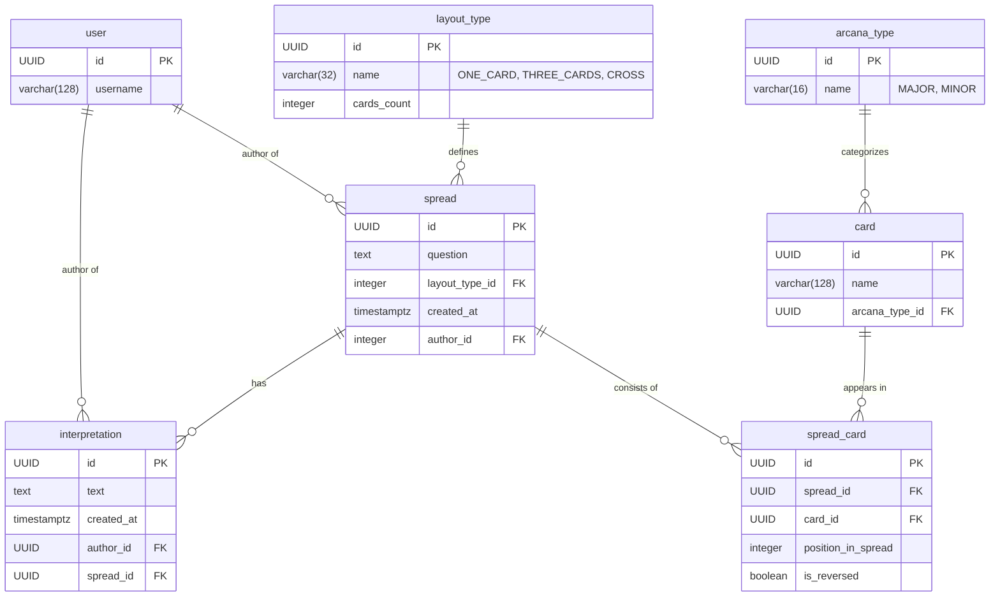

# Веб-сервис "Тарология"

## Описание курса

https://github.com/Discipliny/highload_systems

## 1. Общие требования

**ФТ 1.1 Идентификация пользователя:** Система должна позволять пользователям взаимодействовать с ней без регистрации и входа. Каждый пользователь идентифицируется по уникальному ID, который он предоставляет при совершении действий.

## 2. Управление Раскладами Таро

### ФТ 2.1 Создание нового расклада

- Пользователь должен иметь возможность запросить новый расклад Таро.
- Для создания расклада пользователь должен предоставить свой ID, текстовый вопрос и выбрать схему расклада.
- Система должна поддерживать минимум три схемы расклада:
  - Одна карта
  - Тройка (три карты)
  - Крест (пять карт)
- Система должна автоматически сгенерировать результат расклада (набор карт) в ответ на запрос пользователя согласно выбранной схеме.
- Созданный расклад (вопрос, схема и выпавшие карты) должен быть сохранен в системе и доступен для просмотра.

### ФТ 2.2 Просмотр списка всех раскладов

- Пользователь должен иметь возможность просматривать общую ленту всех раскладов, созданных в системе всеми пользователями.
- Расклады в ленте должны быть отсортированы в хронологическом порядке (от самых новых к самым старым).
- В списке для каждого расклада должна отображаться краткая информация, как минимум — текст вопроса.

### ФТ 2.3 Просмотр детальной информации о раскладе

Пользователь должен иметь возможность открыть любой расклад из списка для детального просмотра.

На странице детального просмотра должна отображаться следующая информация:

- Исходный вопрос, заданный пользователем.
- ID пользователя, создавшего расклад.
- Названия выпавших карт.
- Все текстовые интерпретации, добавленные другими пользователями к этому раскладу.

### ФТ 2.4 Удаление расклада

- Пользователь должен иметь возможность удалить созданный им расклад.
- При удалении расклада должны быть удалены все связанные с ним интерпретации.
- Система должна проверять, что пользователь удаляет только свой собственный расклад.

## 3. Управление Интерпретациями

### ФТ 3.1 Добавление интерпретации к раскладу

- Любой пользователь должен иметь возможность добавить свою текстовую интерпретацию (толкование) к любому существующему раскладу.
- Несколько разных пользователей могут добавлять интерпретации к одному раскладу.
- Один пользователь может иметь только одну интерпретацию на каждый расклад (но может ее редактировать).
- Для добавления интерпретации пользователь должен предоставить свой ID и текст.
- После добавления интерпретация должна отображаться в списке всех интерпретаций на странице детального просмотра соответствующего расклада.

### ФТ 3.2 Редактирование собственной интерпретации

- Пользователь должен иметь возможность изменить текст ранее добавленной им интерпретации.
- Система должна проверять, что пользователь редактирует только свою собственную интерпретацию, а не чужую.

### ФТ 3.3 Удаление собственной интерпретации

- Пользователь должен иметь возможность удалить свою интерпретацию.
- Система должна проверять, что пользователь удаляет только свою собственную интерпретацию.

## 4. Управление пользователями

### ФТ 4.1 Удаление пользователя и всех его данных

- Система должна поддерживать транзакционное удаление пользователя вместе со всеми его данными.
- При удалении пользователя должны быть удалены:
  - Все расклады, созданные этим пользователем
  - Все интерпретации к этим раскладам от других пользователей
  - Все интерпретации этого пользователя к чужим раскладам
- Вся операция должна выполняться в рамках одной транзакции для обеспечения целостности данных.

## Модель данных и структура БД

## Спецификация API (API Layer)

### Расклады (`/api/v0.0.1/spreads`)

#### POST /api/v0.0.1/spreads

- **Назначение:** Создать новый расклад.
- **Тело запроса:** `{ "userId": number, "question": "string", "layoutType": "ONE_CARD|THREE_CARDS|CROSS" }`
- **Успешный ответ:** 201 Created с JSON-объектом созданного расклада.

#### GET /api/v0.0.1/spreads

- **Назначение:** Получить постраничный список всех раскладов.
- **Параметры запроса:** `?page=<номер_страницы>&size=<размер_страницы>`
- **Успешный ответ:** 200 OK с JSON-массивом раскладов. В HTTP-заголовке ответа должен присутствовать X-Total-Count с общим количеством записей.

#### GET /api/v0.0.1/spreads/scroll

- **Назначение:** Получить следующую порцию раскладов для "бесконечной прокрутки".
- **Параметры запроса:**
  - `after=<id>` - ID расклада, после которого нужно получить следующие записи (опционально)
  - `size=<размер_страницы>` - количество записей для получения
- **Успешный ответ:** 200 OK с JSON-массивом раскладов.
- **Примечание:** Если параметр `after` не указан, возвращаются самые новые расклады.

#### GET /api/v0.0.1/spreads/{id}

- **Назначение:** Получить детальную информацию о конкретном раскладе.
- **Параметр пути:** id (идентификатор расклада).
- **Успешный ответ:** 200 OK с JSON-объектом расклада.
- **Ответ в случае ошибки:** 404 Not Found, если расклад не найден.

#### DELETE /api/v0.0.1/spreads/{id}

- **Назначение:** Удалить расклад.
- **Параметр пути:** id (идентификатор расклада).
- **Тело запроса:** `{ "userId": number }`
- **Успешный ответ:** 204 No Content (без тела ответа).
- **Ответ в случае ошибки:** 403 Forbidden, если пользователь пытается удалить чужой расклад.

### Интерпретации (`/api/v0.0.1/spreads/{spreadId}/interpretations`)

#### POST /api/v0.0.1/spreads/{spreadId}/interpretations

- **Назначение:** Добавить новую интерпретацию к существующему раскладу.
- **Параметр пути:** spreadId (идентификатор расклада).
- **Тело запроса:** `{ "userId": number, "text": "string" }`
- **Успешный ответ:** 201 Created с JSON-объектом созданной интерпретации.
- **Ответ в случае ошибки:** 409 Conflict, если пользователь уже имеет интерпретацию к этому раскладу.

#### PUT /api/v0.0.1/spreads/{spreadId}/interpretations/{id}

- **Назначение:** Обновить текст существующей интерпретации.
- **Параметры пути:**
  - spreadId (идентификатор расклада)
  - id (идентификатор интерпретации)
- **Тело запроса:** `{ "userId": number, "text": "string" }`
- **Успешный ответ:** 200 OK с JSON-объектом обновленной интерпретации.
- **Ответ в случае ошибки:** 403 Forbidden, если пользователь пытается редактировать чужую интерпретацию.

#### DELETE /api/v0.0.1/spreads/{spreadId}/interpretations/{id}

- **Назначение:** Удалить интерпретацию.
- **Параметры пути:**
  - spreadId (идентификатор расклада)
  - id (идентификатор интерпретации)
- **Тело запроса:** `{ "userId": number }`
- **Успешный ответ:** 204 No Content (без тела ответа).
- **Ответ в случае ошибки:** 403 Forbidden, если пользователь пытается удалить чужую интерпретацию.

### Пользователи (`/api/v0.0.1/users`)

#### POST /api/v0.0.1/users

- **Назначение:** Создать нового пользователя.
- **Тело запроса:** `{ "id": number }`
- **Успешный ответ:** 201 Created с JSON-объектом созданного пользователя.
- **Ответ в случае ошибки:** 409 Conflict, если пользователь с таким ID уже существует.

#### GET /api/v0.0.1/users

- **Назначение:** Получить постраничный список всех пользователей.
- **Параметры запроса:** `?page=<номер_страницы>&size=<размер_страницы>`
- **Успешный ответ:** 200 OK с JSON-массивом пользователей.

#### GET /api/v0.0.1/users/{id}

- **Назначение:** Получить информацию о пользователе.
- **Параметр пути:** id (идентификатор пользователя).
- **Успешный ответ:** 200 OK с JSON-объектом пользователя.
- **Ответ в случае ошибки:** 404 Not Found, если пользователь не найден.

#### PUT /api/v0.0.1/users/{id}

- **Назначение:** Обновить информацию о пользователе.
- **Параметр пути:** id (идентификатор пользователя).
- **Тело запроса:** `{ /* обновляемые поля */ }`
- **Успешный ответ:** 200 OK с JSON-объектом обновленного пользователя.
- **Ответ в случае ошибки:** 404 Not Found, если пользователь не найден.

#### DELETE /api/v0.0.1/users/{id}

- **Назначение:** Удалить пользователя и все связанные с ним данные.
- **Параметр пути:** id (идентификатор пользователя).
- **Успешный ответ:** 204 No Content (без тела ответа).
- **Примечание:** Операция удаляет все расклады и интерпретации пользователя в рамках одной транзакции.

## Бизнес-логика (Service Layer)

### Процессы для "Раскладов"

#### Создание нового расклада:

1. Получив `userId`, `question` и `layoutType`, система создает новую запись Spread.
2. В зависимости от выбранной схемы (layoutType) генерируется соответствующее количество случайных карт:
   - ONE_CARD: 1 карта
   - THREE_CARDS: 3 карты
   - CROSS: 5 карт
3. В связующей таблице сохраняются ID расклада, ID каждой выпавшей карты и ее атрибуты (позиция в раскладе, перевернута или нет).
4. **Правило:** Вся операция (пункты 1-3) должна выполняться в рамках одной транзакции. Если любая часть процесса завершается ошибкой, все изменения в базе данных отменяются (rollback).

#### Получение списка раскладов:

- Система запрашивает из базы данных список раскладов, отсортированный по дате создания (от новых к старым).
- Для эндпоинта `/api/v0.0.1/spreads` дополнительно выполняется запрос на получение общего количества записей в таблице.

#### Получение одного расклада:

- Система извлекает из базы данных запрошенный расклад, а также все связанные с ним карты и все связанные интерпретации.

#### Удаление расклада:

1. Система проверяет, что `userId` из запроса совпадает с `userId` автора расклада.
2. Удаляются все интерпретации, связанные с раскладом.
3. Удаляются все записи о картах в раскладе из таблицы SpreadCard.
4. Удаляется сам расклад.
5. **Правило:** Вся операция должна выполняться в рамках одной транзакции.

### Процессы для "Интерпретаций"

#### Добавление интерпретации:

1. Система проверяет, что расклад с указанным `spreadId` существует.
2. Система проверяет, что у пользователя еще нет интерпретации к этому раскладу (проверка уникальности по комбинации `userId` + `spreadId`).
3. Если проверка пройдена, создается новая запись Interpretation, которая связывается с ID расклада и ID пользователя-автора.
4. Если у пользователя уже есть интерпретация к этому раскладу, возвращается ошибка 409 Conflict.

#### Редактирование интерпретации:

- **Правило:** Перед обновлением текста интерпретации система должна убедиться, что `userId` из запроса совпадает с `userId` автора, который изначально создал эту интерпретацию.

#### Удаление интерпретации:

- **Правило:** Перед удалением система должна убедиться, что `userId` из запроса совпадает с `userId` автора интерпретации.

### Процессы для "Пользователей"

#### Удаление пользователя и всех его данных:

1. Система находит все расклады, созданные пользователем.
2. Для каждого расклада:
   - Удаляются все интерпретации других пользователей
   - Удаляются все записи о картах из таблицы SpreadCard
   - Удаляется сам расклад
3. Удаляются все интерпретации этого пользователя к чужим раскладам.
4. Удаляется запись пользователя.
5. **Правило:** Вся операция должна выполняться в рамках одной транзакции для обеспечения целостности данных.
